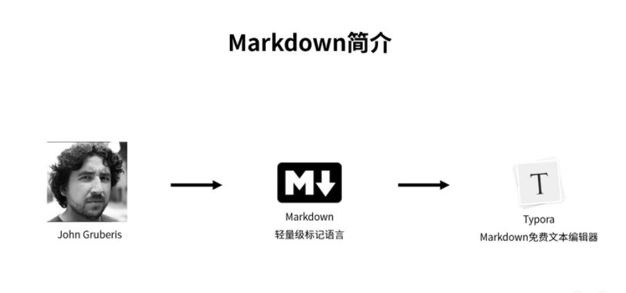
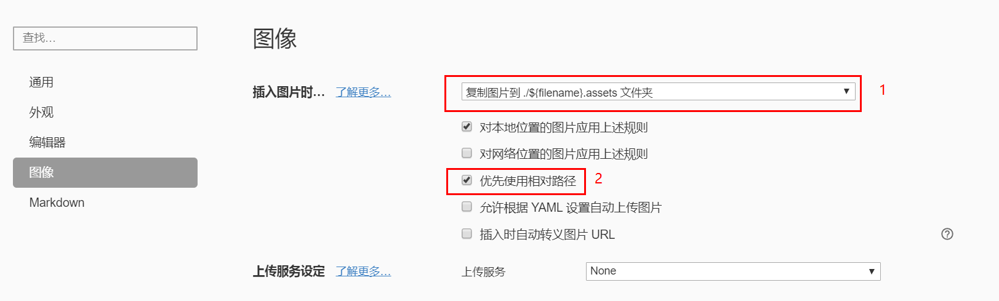

# Markdown介绍

[TOC]

## 1. markdown简介

- John Gruberis开发



- Typora下载

[下载链接：www.typora.io](https://www.typora.io)

## 2. markdown常用语法

### 多级标题

- 快捷键：**Ctrl + 1-6**
- 清除：**Ctrl + 0**

### 有序列表

- 快捷键：**Ctrl + Shift + [**
- **两次回车键 或 ↓方向键** 退出列表模式
- 降级快捷键：**Tab**
- 升级快捷键：**Shift + Tab**

1. 打开冰箱
    1. 插电
    2. 开机
    3. 开门
2. 把大象放进冰箱
3. 关闭冰箱

### 无序列表

快捷键：**Ctrl + Shift + ]**

### 任务列表

创建方式： **- [ ] 任务1**

- [ ] 任务1
- [x] 任务2
- [ ] 任务3

### 插入表格

创建方式： **| 学号 | 性命 | 性别 | --> 回车**

注意：添加一行，只需要 **Ctrl + 回车**

快捷键：**Ctrl + T**

| 学号 | 姓名 | 性别 | 年龄 |
| ---- | ---- | ---- | ---- |
| 001  | 张三 | 男   | 20   |
| 002  | 李四 | 女   | 21   |

### 行内代码

创建方式：**\`行内代码\`**

快捷键：**Ctrl + Shift + `**

`Java`、`C`、`C++`和`Python`的学习

### 代码块

创建方式：**```java 或者 ~~~java**

快捷键：**Ctrl + Shift + K**

相关设置：显示行号、代码缩进，最后重启Typora

第一个`java`代码：

```java
public class helloworld {
    public static void main(String[] args) {
        System.out.println("helloworld.");
    }
}
```

### 插入图片

创建方式：**\!\[]()**

快捷键：**Ctrl + Shift + I**

相关设置：文件->偏好设置->图片插入->**相对路径-**>重启Typora

示例：




# END